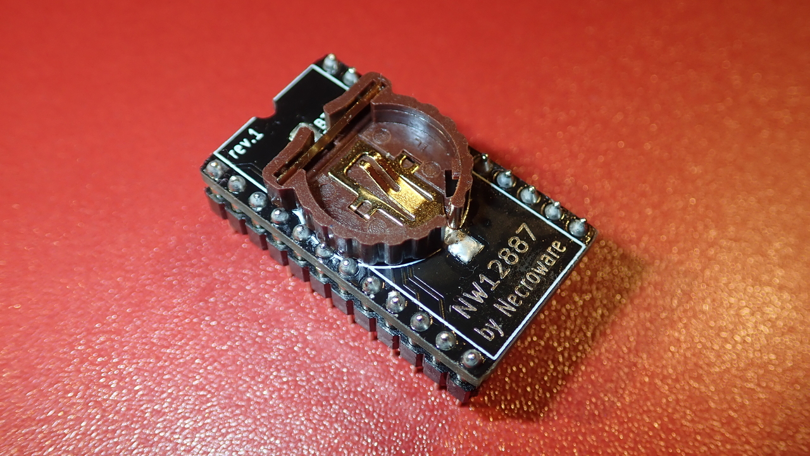
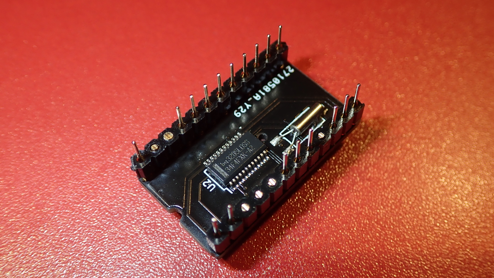

# Necroware's NW12887 RTC module

 

This is a drop-in replacement for RTC modules with solid body. Such modules were
widely used on 486 and Pentium mainboards back in the days. After so many years
the battery inside of such modules got empty and there is no way to exchange it.
With empty battery BIOS settings can not be saved and so many mainboards can't
even boot properly. This alternative solution has a socket for CR1225 and the
battery can be easily replaced again, when it gets empty.

This part should be compatible with following RTC modules:

* Dallas DS1287 / DS12887 / DS12B887
* Benchmarq BQ3287
* ODIN OEC12C887

## Bill of Materials

Part | # | Description
-----|---|-------------------------------------
U1   | 1 | Real-Time Clock BQ3285LDSS SSOP-24
Y1   | 1 | Crystal oscillator 32kHz 6pF
BT1  | 1 | CR1220 / CR1225 SMD battery holder

